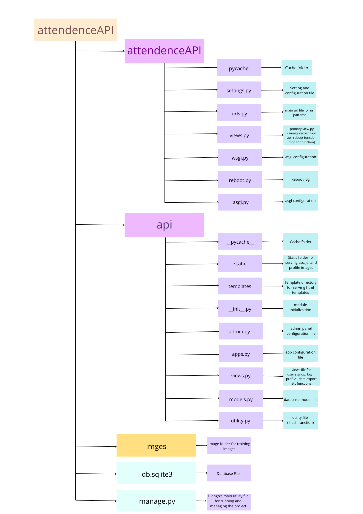

<div align="center">

# Face-Recognition
## Attendance System 

<div style="width:25%;">

</div>


[](https://code.visualstudio.com/)
[](https://github.com/File_authentication)
<br/>


</div>


<div >
  <div align="center">Link of Figma design for SignIn-SignUp page : 
  <a href="https://www.figma.com/file/n6zN6WsPpC3Fq7KmB8zADR/face-recognition?node-id=0%3A1"> @Figma </a> </div>
</div>

#
## Features

1) Password protection for new person registration.
2) Creates/Updates CSV file for deatils of students on registration.
3) Creates a new CSV file everyday for attendance and marks attendance with proper date and time.
4) Displays live attendance updates for the day on the main screen of the admin with the name and timestamp.

#
## Installation

### Method 1 :
> Running development server in Local Mechine 

#### For Linux
#### [ Pre-requisite ] : 
- Python 3.6 or above
- dlib library
- python-virtualenv

#### [ step 1 ] :
- clone the repository
``` 
git clone https://github.com/padmaja2305/face-recognition
```
#### [ step 2 ] :
- Open terminal and navigate to the directory
```
cd face-recognition
```
#### [ step 3 ] :
- Create virtual environment
```
python -m venv venv
```

#### [ step 4 ] :
- Activate virtual environment
```
source venv/bin/activate
```
#### [ step 5 ] :
- Install dependencies
```
pip install -r requirements.txt
```
#### [ step 6 ] :
- Run the server
```
python manage.py runserver
```
#### [ step 7 ] :
- Open browser and navigate to http://localhost:8000/

#
## Uses
1) Mark attendance easily by using face recognition api.
2) Can directly download the attendance of every student in excel format.
3) It is Cost-Effective as it can save business resources by automatic student time tracking.
4) More Accurate and Better Student Attendance because no proxy system will be there.
5) As compared to manual attendance systems, AI-based attendance systems are highly automated and easy to manage.

#
## Architecture
<div align=center>

</div>

#
## Directory Structure
 <div align=center>

</div>

#
## Schematics
<div align=center>

<br>
<br>

<br>
<br>

</div>


